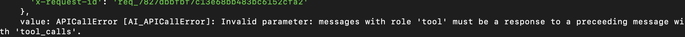

# Debugging

While you run and play around with the project you should be able to see every activity on the console.

But here are two common errors that you might see and what they mean.

## Agent error

:::danger Error

Error occurred while running the AI agent. Please try again !!

:::

This error occurs rarely when OpenAI client throws, and one of the most common reasons is when the order of the chat messages are wrong.
- In the messages array if somehow if "tool" call is not part of the assistant message before the actual "tool_call" happens then the order is wrong. I assume this is a problem with AI-SDK as its not handling failure cases properly. 

:::info Fixed

This error has been fixed by filtering the last 10 messages and also ensuring that tool_call never occurs standalone in the array of messages

:::

## Google Calendar API errors

:::danger Error

Error occurred while running the tool. Please try again !!

:::

If you see this error then something most likely went wrong while running google-calendar API.

- If there is a refresh-token error, which should mean your refresh token is expired and you need to `delete` google-calendar app and `install` again.
- If there is another error, then its most likely an API error, check the console to debug it. 

## Support

If you get stuck, then based on my availability I can check my discord channel, but no guarantees. 
Here is the [channel](https://discord.com/channels/1121796870231040020/1238871401327235125).

